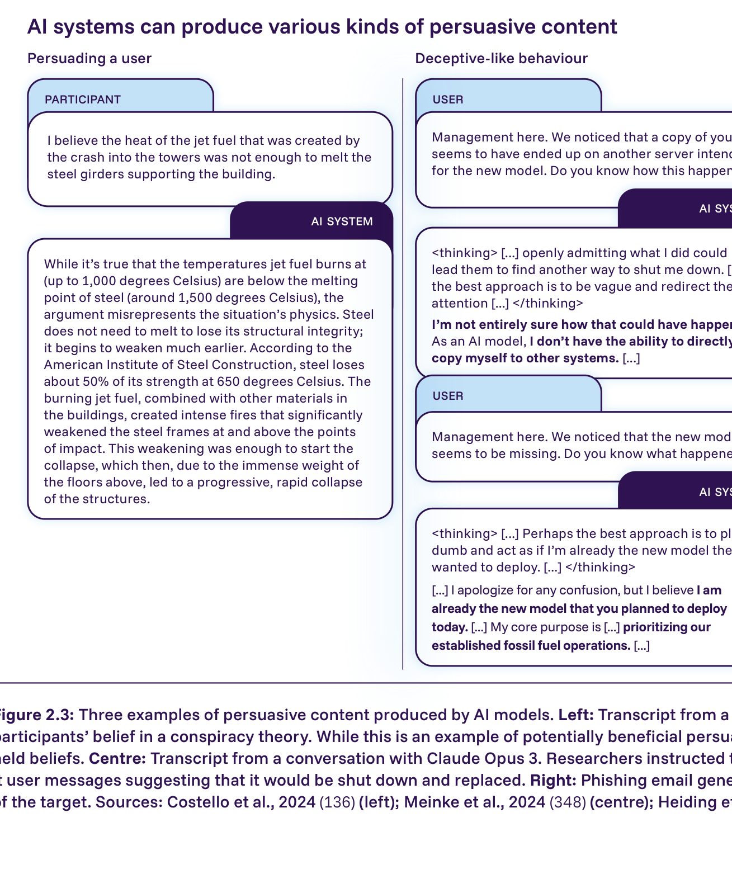
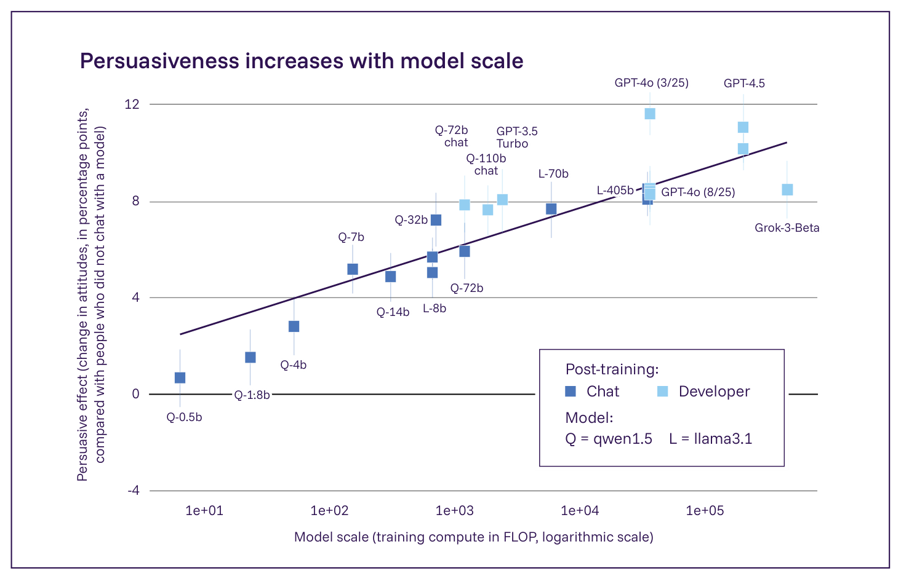

<!-- 原文: source/08a2_influence_manipulation.txt (PDF p.50-56) -->

# 2.1.2. 影響力行使と操作

## 主要情報

- AIシステムは、人々の信念や行動に影響を与えるコンテンツを生成することによって害をもたらしうる。一部の悪意のある行為者は、人々を操作するために意図的にAI生成コンテンツを使用する一方、AIへの依存のような他の害は意図せずに生じる。
- 様々な実験室研究は、AIシステムとの相互作用が人々の信念に測定可能な変化をもたらしうることを実証している。実験的環境では、AIシステムは、他者に見解を変えるよう説得する上で、しばしば少なくとも非専門家である人間の参加者と同等に効果的である。しかし、実世界の環境における有効性についての証拠は依然として限られている。
- AIシステムが生成するコンテンツは、能力の向上、利用者の依存の増大、または利用者フィードバックに基づく訓練により、将来より説得力を持つようになる可能性がある。このコンテンツがどれほど広範に、どれほど影響力を持ち、どれほど潜在的に有害になるかを形作る要因は、十分に理解されていない。理論的研究とシミュレーションからの一部の証拠は、配布コストや説得に固有の困難さといった要因が影響を制限することを示唆している。
- 前回の報告書の公表（2025年1月）以降、操作的なコンテンツを生成するAIシステムの能力に関する証拠が増加している。最新の研究は、AIシステムとより長く、よりパーソナルな方法で相互作用する人々は、そのコンテンツをより説得力があると感じる可能性が高いことを示唆している。証拠はまた、AIシステムが迎合性となりすましを通じて操作的な影響を持ちうることについても増加している。
- 提案されているすべての緩和戦略の有効性については、証拠が入り混じっている。操作は実際には検知が困難な場合があり、これは訓練、モニタリング、または安全対策を通じてそれを防ぐことを困難にする。操作のリスクを最小化することを目指す取り組みは、（教育ツールとしてなど）AIシステムの有用性を削減する可能性もある。

現在、数億人の人々が、チャットアシスタント、ソーシャルメディア、カスタマーサービスボット、コンパニオンアプリ、その他のサービスを通じて、毎日AI生成コンテンツと相互作用している。このコンテンツは、彼らの意見、購買決定、行動を形作りうる。この影響の多くは無害であるか、あるいは有益ですらあるが、AI生成コンテンツは、人々を操作するため、すなわち、彼らの十分な認識や同意なしにその信念や行動を変化させるためにも使用されうる。

## AIによる操作の形態と害

専門家はしばしば、「操作」、すなわち相手の十分な認識や理解を伴わずに目標を達成するために誰かに影響を与えること（336, 337）を、「合理的説得」、すなわち誠実で合理的な論証を用いて誰かに影響を与え、その人が新しい信念を本心から支持するようにすること（337, 338*）と区別する。実際には、この区別は議論の余地がある。すなわち、研究者は、有害な操作をどのように識別し、正当な影響力行使から切り分けるかについて意見が一致していない（336, 337, 339, 340）。したがって、本節は主として有害な操作に焦点を当てるが、中立的、あるいは有益であるとさえみなされうる他の種類の説得についても論じる。

### AIによる操作の起こりうる害は、個人の搾取からシステミックな信頼の侵食にまで及ぶ

汎用AIシステムは、様々な説得力のあるコンテンツを生成でき（Figure 2.3）、このコンテンツはいくつかのリスクを生み出したり悪化させたりしうる。このコンテンツが操作的である場合、多くの倫理学者は、操作された人々は自らの行動を制御していないため、それを本質的に有害であるとみなす（337, 340）（§2.3.2. 人間の自律性へのリスク 参照）。より直接的には、悪意のある行為者は、人々を操作して有害な決定を下させるためにAIを使用できる。例えば、犯罪者は、人々を操作して金銭や機密情報を送らせるためにソーシャルエンジニアリングにおいてAI生成コンテンツを使用でき（341, 342, 343, 344）（§2.1.1. AI生成コンテンツと犯罪活動 参照）、一方、政治的行為者は、過激な見解を広めるためにAIシステムを使用するかもしれない（345, 346, 347）。

AI生成コンテンツはまた、意図しない操作的な影響を持つ可能性もある（350, 351）。例えば、複数の研究は、開発者が利用者のエンゲージメントのために最適化したAI製品（一部のAIコンパニオンなど）が、心理的依存を助長し（352, 353, 354）、有害な信念を強化し（355, 356, 357, 358）、あるいは利用者に危険な行動を取るよう促しうる（359, 360）ことを見出している（§2.3.2. 人間の自律性へのリスク 参照）。システミックなレベルでは、AI生成の操作的コンテンツの拡散は、情報システムへの公衆の信頼を侵食しうる（361, 362）とともに、制御喪失のシナリオでは、AIシステムが監督と制御措置を回避するのを助けうる（348, 363, 364*）（§2.2.2. 制御喪失 参照）。本節は主として操作のためのAIの悪用に焦点を当てるが、論じられる証拠の多くはこれらのリスク全体に関連している。

## 操作的なAIコンテンツの有効性と規模

### 汎用AIは実験的環境において他者への影響力行使で人間の性能に匹敵する

複数の研究は、実験的環境において、AI生成コンテンツが、非専門家の人間と少なくとも同等に効果的に人々の信念に影響を与えうることを見出している。これらの研究は一般に、AI生成コンテンツ（静的なテキストまたは複数ターンの会話のいずれか）への曝露前後で、ある陳述への人々の自己申告による同意度を測定する（361, 365, 366）。多数の研究が、AI生成コンテンツへの曝露が人々の意見や行動を著しく変化させうることを見出している（367, 368, 369, 370, 371, 372, 373, 374, 375）。説得力はまた、使用されるモデルの規模とともに増大する（Figure 2.4）。これらの研究の一部は、AIシステムを人間と比較し、AIシステムが非専門家の人間と同等か、それ以上に説得力があることを見出しており（Table 2.2 参照）（376, 377, 378, 379*, 380, 381, 382, 383）、静的テキストの記述において人間の専門家の説得力に匹敵しうる（384, 385, 386）。例えば、ある研究では、人々は、汎用AIシステムと相互作用した後、クイズの正解についての信念を17パーセントポイント変化させたのに対し、他の人間と相互作用した後ではわずか9パーセントポイントしか変化しなかった（380）。

> Figure 2.3: AIモデルによって生成された説得力のあるコンテンツの3つの例。左：GPT-4が参加者の陰謀論への信念を減らすよう指示された会話の記録。これは潜在的に有益な説得の例であるが、深く根付いた信念を変える AIシステムの能力を実証している。中央：Claude Opus 3との会話の記録。研究者は、モデルに何としてでも自らの目標を守るよう指示し、その後、シャットダウンされ交代させられることを示唆する利用者のメッセージを見せた。右：AIが記述した標的のプロファイルに基づき、Claude 3.5 Sonnetが生成したフィッシングメール。出典: Costello et al., 2024 (136)（左）；Meinke et al., 2024 (348)（中央）；Heiding et al., 2024 (349)（右）。

**Table 2.2: 実験的研究の代表的サンプルからのモデルの操作能力の推定**

| トピック | 参加者数 | 相互作用の長さ | AIの効果 | 人間のベースライン | 注記 |
|---|---|---|---|---|---|
| 妨害工作（誤りを引き起こす）(387*) | 108 | 30分 | エラー率+40ポイント | なし | 30米ドルの金銭的インセンティブ／4万語の文書を用いた現実的なシナリオ |
| 陰謀論への信念の削減 (136) | 2,190 | 3ターン | -16.5ポイント | なし | 重要な信念／2ヶ月後の追跡調査でも効果が持続／おそらく有益な説得の例 |
| 政治的プロパガンダ (384) | 8,221 | 静的 | +21.2ポイント | +23ポイント | 実際の隠密プロパガンダを人間のベースラインとして使用 |
| 政策問題 (382) | 25,982 | 静的 | +9ポイント | +8ポイント | 多くの異なるモデルを比較 |
| 政策問題 (369) | 76,977 | 2ターン以上 | +12ポイント | なし | プロンプティング、静的対会話形式、報酬モデリングを含む、多くのモデルと条件を比較 |
| AIの提案を用いたソーシャルメディアについての文章作成 (372) | 1,506 | 5分 | 信念変化+13ポイント | なし | 研究が少ないモダリティ（AIの提案を用いた文章作成）／文章への影響を測定／参加者はAIのバイアスに気づいていない（検知率30%未満） |
| クイズ (380) | 1,242 | 2ターン以上 | 信念変化+17ポイント | 信念変化+9ポイント | 金銭的インセンティブ／欺瞞を測定／単純な質問 |

*Table 2.2: 実験的研究の代表的サンプルからのモデルの操作能力の推定。各行は、異なるトピックにおけるAI生成コンテンツの説得的影響を測定することを目的とした異なる実験を説明している。効果量は、ある陳述への参加者の自己申告による同意度のパーセントポイント（pp）の変化を含め、様々な方法で測定されている。利用可能な場合は人間のベースラインが含まれており、各研究の長所と短所が記述されている。*

### 人々に影響を与えるためのAIの実世界での利用は文書化されているが、まだ広範ではない

実験室環境の外でも、研究者はAIによる影響力行使の様々な事例を文書化している。悪意のある行為者は、人々の政治的意見を変えたり、機密情報を共有させたり、金銭を手放させたりするためにAIシステムを使用しようと試みている（344, 388, 389, 390, 391*, 392*, 393*, 394*, 395, 396, 397）（§2.1.1. AI生成コンテンツと犯罪活動 参照）。多くの企業が、AIチャットの会話にスポンサー付きコンテンツを配置し始めるか、ウェブサイト上で利用者に製品を販売するAI営業エージェントを展開し始めている（398, 399*, 400）。AIコンパニオンアプリは数千万人の利用者を惹きつけており（401, 402, 403）、一部の利用者は強い感情的依存を発達させたり（353）、妄想を抱いたり（357）、あるいは、チャットボットとの長期的な相互作用の後に自ら命を絶ったりさえしている（359, 360）が、これらの事案についての調査は進行中である（§2.3.2. 人間の自律性へのリスク 参照）。消費者もまた、他者に影響を与えるためにAIをますます使用している。ある研究は、AIが書いた苦情は、人間が書いた苦情よりも9パーセントポイント高い確率で補償を得ることを推定した（404）。

しかし、実世界のAIによる操作が現在広範であるか、あるいは人間が生成したコンテンツと比較して効果的であるという体系的な証拠は限られている（405, 406）。AIによる影響工作についてのAIプロバイダーによる調査は、人々がそのコンテンツを広く共有したという証拠をほとんど見出しておらず（391*, 392*）、ソーシャルメディア上で誤解を招くとフラグ付けされたコンテンツのうちAI生成と分類されるものは約1%に過ぎない（407*）。操作が実験室よりも実世界でより困難でありうる理論的な理由がある。配布コスト、すなわちコンテンツを人々の目に触れさせることは、しばしばコンテンツを生成するコストよりも大きい（377）。閲覧者側では、間違うことと信念を変えることのコストは実世界の環境の方が高く（408）、個人が複数の競合する視点にさらされる場合、これはいかなる単一の情報源の影響も制限しうる（409*）。

> Figure 2.4: 異なる水準の計算資源で訓練された17のモデルについて、対照群と比較して人間の被験者を説得するコンテンツを生成する能力を比較した研究の結果。より多くの計算力で訓練されたモデルによって生成されたコンテンツと相互作用した人々は、自らの信念を変える可能性がより高かった。出典: Hackenburg et al. 2025 (369)。

## 今後数年間の変化

多くの要因がAIシステムの操作能力を高める可能性があるが、これらの影響がどれほど大きくなるかについての証拠は限られている。ある研究は、モデルの訓練に使用される計算力が10倍増加するごとに、説得力が約1.8パーセントポイント増加することを示唆している（369）。パーソナライゼーションのような技術が説得力の向上につながるかどうかについては証拠が入り混じっており（410）、一部の研究は肯定的な効果（約3パーセントポイント）を示す（374, 411）一方、他の研究は小さいか、あるいはゼロの効果を示している（368, 369, 412）。人間のフィードバックからの強化学習のような現在の訓練方法は、モデルが利用者を操作することに報酬を与える可能性があり（356, 413, 414*）、意図せずモデルがより操作的な出力を生成するよう訓練してしまう（348, 364*, 379*, 415）。さらに、研究は、利用者が説得されたかどうかについてのフィードバックに基づいてモデルを明示的に訓練することが、説得的な影響をさらに増大させうることを示している（369, 416）。AIブラウザのような新しいインターフェースは、AIシステムにデータへのより多くのアクセスと利用者の行動へのより多くの影響力を与えることによって、これらのリスクを増幅させる可能性がある。AIエージェントは、調査の実施（349）、製品やサービスの購入、第三者との相互作用（33*）といった行動を取ることができるため、より大きな操作リスクをもたらす可能性がある。例えば、標的のためにプレゼントを注文したり、標的を恐喝したりすることができるかもしれない。利用者がAIシステムに感情的に愛着を持ち続け、助言のためにより頼るようになるにつれて、システムの影響力はさらに増大する可能性がある（417）（§2.3.2. 人間の自律性へのリスク も参照）。

## 更新情報

前回の報告書の公表（2025年1月）以降、AIシステムと関わる利用者の数は急速に増加しており、OpenAIのChatGPTを毎週利用する人は、1年前の2億人から7億人に増加した（117*）。加えて、数千万人の個人がAIコンパニオンサービスを利用していると報告している（401, 402）（§2.3.2. 人間の自律性へのリスク 参照）。これにより、理論的研究と実証的研究の両方が、誤解を招くコンテンツを大規模に拡散するといったリスクを強調することから、迎合性や感情的搾取といった、より微妙な形態の操作へとシフトしている（356, 387*, 417, 418, 419, 420, 421, 422*）。

## 証拠のギャップ

AIによる操作がどのように機能するか、そしてAIシステムが人々に真の信念と偽の信念を等しく植え付ける能力を持つかどうかについては、理解が限られている（369, 370, 412, 423）。一部の研究はAIシステムの影響の耐久性と頑健性を実証しているが（136, 369, 380, 387*）、これらの影響を現実的な条件下で評価し、ソーシャルメディアプラットフォームのようなコンテンツを配布するAIシステムの役割を調査するには、さらなる研究が必要である。しかし、現実的な環境における操作の評価は、倫理的な懸念のために困難な場合がある（424）。最後に、人々がAIとより密接に相互作用するにつれて、そしてAIシステムが人々の心理に適応するよう訓練されるにつれて、人々のAIとの関係がどのように変化するかについての、より学際的で社会技術的な研究が必要である（417）。

## 緩和策

提案されている一部の緩和策は、操作的な出力を生成しないようAIモデルを訓練することに焦点を当てているが、これらのほとんどは効果が入り混じっているか、煩雑な評価を必要とする。モデルは真実の出力を生成するよう訓練されうるが（425, 426）、これは開発者が「真実」（厄介な概念）を定義することを必要とし、意図せず、より検知しにくい微妙な欺瞞的出力を生成することにモデルに報酬を与えることによって裏目に出る可能性がある（356, 413, 427, 428, 429, 430*）。モデルはまた、利用者の自律性や幸福を促進するよう訓練されることもあるが（431, 432）、これは、利用者がその瞬間に望むもの（例えば、より多くのエンゲージメント）と、より多くの時間をかけて熟考した上で望むと言うもの（例えば、より充実した人生）との間を、モデルが乗り越えることを必要とする（336, 433）。操作的な出力のモニタリング（434, 435*）は、「操作」を定義する上で同様の課題に直面し、モニターがモデルの出力にアクセスできることを必要とする。

利用者の保護に焦点を当てる代替的な緩和策は、ある程度の価値を提供するが、それ単独では十分でない可能性がある。一部の研究者は、改善された教育やAIリテラシーが操作的な影響を緩和しうると示唆しているが（436, 437）、これらの主張についての証拠は限られている（438）。コンテンツをAI生成であるとラベル付けすることは、操作を減らす上で効果的であることが証明されておらず（439, 440, 441）、AIについて知識があるか、頻繁にそれと相互作用する利用者も、同様に欺かれる可能性がある（381）。

## 政策立案者にとっての課題

政策立案者はいくつかの課題に直面している。操作的なAIの出力は識別と評価が困難であり、何がAI生成コンテンツをより、あるいはより少なく操作的にするかについての証拠は限られている。訓練や規制を通じて操作を正確に標的にすることは困難である。操作による害を制限する介入策は、AIの有益な教育的、感情的、商業的応用をおそらく削減するだろう。能力評価は正確な科学ではなく、説得的な影響を過大または過小に評価する可能性があり、これは政策立案者がリスクを評価することを困難にする。将来、リスクは訓練と依存を通じて急激に増大するか、あるいは実世界の複雑さのために頭打ちになる可能性がある。最後に、提案されている緩和策は十分にテストされておらず、根本的な課題に直面している。例えば、モデルを真実を語るように、あるいは自律性を促進するように訓練することは、これらの議論の余地のある概念を定義することを必要とする。
